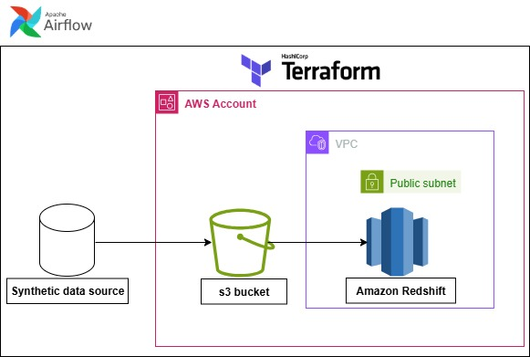

# Salespulse Data Pipeline

## End-to-End-E-commerce Data Pipeline


SalesPulse is a simulated e-commerce platform that generates transactional data and demonstrates a full end-to-end data pipeline. The project ingests raw data, processes it through ETL workflows, and delivers analytics-ready datasets stored in Amazon Redshift to support business intelligence and reporting.


## Architecture


Built with:

+ Apache Airflow (Orchestration)

+ Python + Faker + pandas (Simulation and transformation)

+ AWS S3 (Object storage)

+ Amazon Redshift (Data warehousing)

+ Terraform (Infrastructure provisioning)

+ Docker (Airflow containerization)

 

## Tech Stack

Apache Airflow (Dockerized)

AWS S3 – Data Lake storage

Amazon Redshift – Data warehouse

Python + pandas + awswrangler – For ETL logic


## Project structure

```bash
├── Airflow
│   ├── Dockerfile
│   ├── aws_utils.py
│   ├── dags
│   │   ├── faker_transaction.py
│   │   ├── faker_transaction_dags.py
│   │   └── my_schema.sql
│   ├── date_utils.py
│   ├── docker-compose.yaml
│   └── requirements.txt
├── Docs
├── README.md
└── Terraform
    ├── VPC_stacks.tf
    ├── backend.tf
    ├── bucket.tf
    ├── iam_policy_doc.tf
    ├── provider.tf
    ├── redshift_stack.tf
    └── variable.tf
```

## What the pipeline Does

## 1. Generate Transaction Data
Using the Faker library, the pipeline simulates realistic e-commerce transaction records:

```bash
first_name, last_name, customer_id, product_id, transaction_date, payment_method, store_location
```
Each run creates between 500,000 and 1,000,000 rows, stored in a pandas.DataFrame.

## 2. Save to S3
Data is saved in Parquet format to a defined S3 path:

```bash
s3 path = f"s3://{s3_bucket}/{s3_folder}/{new_date}_data_file.parquet"
```

## 3. Load to Amazon Redshift
Using Airflow's native S3ToRedshiftOperator, the pipeline loads the parquet file into a table called ```transactions``` under the ```public``` schema.

Orchestrated with Airflow DAG using the following flow:

```bash 
get_transaction_data >> execute_query >> s3_to_redshift
```

# How to Run the Project

## 1. Provision AWS Infrastructure with Terraform

```bash 
cd infrastructure/
terraform init
terraform apply
```

Creates:

An S3 bucket: ```faker-project```

A Redshift cluster

Relevant IAM roles

A VPC and its stacks


## 2. Start Airflow (Docker)
To build your Docker image for Airflow, follow these steps:
1. Open your terminal in the directory where your Dockerfile is located.

2. Run the following command to build your image

```bash 
docker build -t imagename .
docker-compose up -d 
```

## 3. Set Airflow Connections

```bash 
From the Airflow UI (`http://localhost:8080`), use the default **username** airflow and password airflow to sign in, then go to **Admin > Connections** and add your credentials(AWS and Redshift Credentials).
```

Redshift COPY is configured using:

```bash
copy_options = ["FORMAT AS PARQUET"]
```


**Images from the project;**


